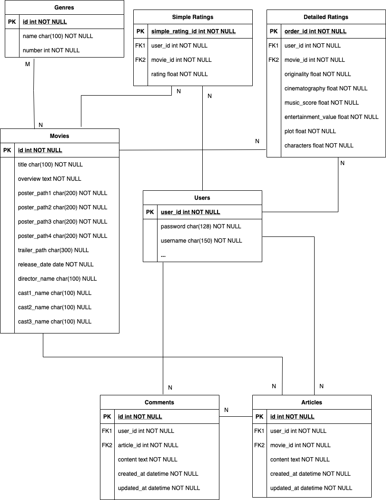

## 전체 프로젝트 공통 정리

---

### 팀원 정보 및 역할 분담

- 박성재: 백엔드
- 문준하: 프론트엔드

---

### 서비스 구현 목표 및 실제 구현 정도

#### 구현 완료

- 별점과 별개로 영화를 평가할 수 있는 지표 추가 도입(Hexa Rating)
- 간단한 추천 알고리즘
- JWT을 활용한 기본 로그인 구현
- 영화 평점 정보를 차트로 시각화
- Three.js를 활용한 3D 화면 구성
- 유저가 입력한 검색어에 따라서 실시간으로 관련 영화들을 보여주는 Search Bar 구현

#### 미구현

- 특정 영화에 대해서 함께 수다를 떨 수 있는 음성채팅 채널 구현

---

### 데이터베이스 모델링 (ERD)

---

### 필수 기능 설명

- 관리자 페이지를 통해 영화 추가 / 수정 / 삭제 가능
- 로그인 한 유저만 영화에 대한 평점을 등록 / 수정 / 삭제 가능하도록 인증 및 권한 구현
- 추천 알고리즘:
  - 로그인한 유저의 경우: 자신이 높게 평가한 상위 영화들 중 가장 많은 장르가 무엇인지 추출. 그 장르의 영화들 중 아직 사용자가 보지 않은 것들로 필터링하여 평균 별점 상위 영화 순으로 추천
  - 로그인하지 않은 경우: 평균 별점 상위 영화순으로 추천
- 영화 상세 페이지 및 커뮤니티:

  - 영화 평점 및 상세정보 제공
  - 해당 영화에 등록된 리뷰 (게시글 및 세부 항목별 평가 내역) 목록 표시
  - 해당 리뷰에 달린 댓글 확인 및 추가 / 수정 / 삭제 가능
  - 리뷰 및 댓글 작성은 로그인 필수, 수정 및 삭제는 본인의 것만 가능

---

### 프로젝트 후기

- 일주일이라는 정해진 기간 안에 구현 목표를 정하고 프로젝트를 진행해 본 것은 처음인데, 확실히 무언가 목표를 정해놓고 검색하고 삽질하면서 만드는 것이 빨리 배우게 되는 것 같다.
- 우리가 제공할 서비스에 맞는 모델링을 하고, 필요한 데이터를 빠르게 전달해주기 위해 고민해보는 좋은 경험이 되었다. 이 과정에서 Django에서 제공하는 QuerySet의 API 중 `select_ralated` 메서드와 `prefetch_related` 메서드를 통해 불필요한 DB 쿼리를 줄임으로써 클라이언트에게 데이터를 보다 빨리 보내줄 수 있는 방법을 알게 되었다. (`select_related` -> DB 쿼리 시 조인 활용, `prefetch_related` -> python에서 캐싱)
- 백엔드 개발자로서의 기초를 단단히 다지기 위해서 데이터베이스에 대해 보다 깊이 공부해야할 필요성을 느꼈다.

---

### 페어 후기

- 프론트엔드와 백엔드 영역을 나눠서 협업을 해본 것이 처음인데, 왜 그토록 개발자에게 의사소통이 중요하다고 하는지 깨닫게 되었다. 서로가 머리 속에서 그리는 그림을 명확한 언어로 전달하고 기록하는 것이 프로젝트 진행에 있어서 윤활유가 되어줄 것이라는 생각이 들었다.
- 프로젝트 페어인 준하님과의 소통은 대체적으로 매끄럽게 진행되어 다행이었다. 프로젝트 후반에 가서 서로가 의도한 구현 방식을 오해하여 진행에 약간의 차질을 빚는 일도 발생했지만, 이 또한 서로가 앞으로를 위해 발전할 밑거름이 되어주었다고 생각한다.
- 구현하고 싶은 사항들을 잘 정리하고 관련 자료를 빠르게 찾고, 또 어려워 보이는 내용도 포기하지 않고 금방 금방 배워서 적용하는 준하님의 모습을 보고 많은 자극을 받았다. 내게 앞으로의 성장을 위한 좋은 귀감이 되어주셨다.
